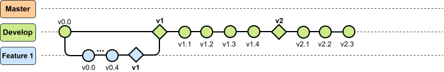

## Rama Develop 

Esta rama tiene por objetivo contener las versiones de los diferentes capítulos del documento e ir trabajando el documento respecto al archivo que se le ha enviado al profesor guía.

Una vez que se finalice el capítulo en esta rama, esta información pasa a la rama *Master*, que es la rama que contiene los capítulos ya finalizados.

### Dev Branch
- Se inicia el trabajo en el repositorio y se comienza a trabajar en la sub rama *Feature1*, correspondiente a la introducción.

- **Dev v1:** Se agrega la información de **F1 v1**, correspondiente a la introducción enviada a Marcelo Pérez para su revisión y comentarios.      

- Dev v1.1: Se corrigen algunos comentarios pero quedan imágenes por mejorar.

- Dev v1.2: Se corrigen las imágenes y se agrega texto a la introducción para mejorar la estructura.

- Dev v1.3: Se corrige la imágene inicial sobre GHG y se agrega una tabla respecto a las características de las baterías. Queda sólo agregar información y además incluir a los otros capítulos dentro del documento.

- Dev v1.4: Se agrega información sobre los tipos de propulsión y también sobre loas diferentes hibridaciones reconocidas.

- **Dev v2:** Se mejora la introducción con información actualizada y además se agrega una estructura del contenido del escrito. Esta versión es enviada a Marcelo Pérez para su revisión.

- Dev v2.1: Se crea una estructura para el capítulo 2: "*Tugs: Description and Operation*".

- Dev v2.2: Se agrega información al capítulo 2 respecto al perfil operacional del remolcador.

- Dev v2.3: Se agrega información del remolcador respecto a cuales son sus funciones principales.

- Dev v2.4: Se corrige la información de cada sección del texto, obteniendo una estructura definitiva para el capítulo 2.

- Dev v2.5: Se mejoran las imágenes de cada sección de capítulo. Queda arreglar las imágenes de las maniobras, agregar tabla de información de la embarcación y agregar información a la sección final "Chapter Summary"

- Dev v2.6: Dada la información adicional relacionada a las dimensiones del remolcador, se agrega la subsección Main Diesel Engine y la subsección Dimensions, las cuales deben ser completadas.

- Dev v2.7: Se completa la subsección *Main Diesel Engine*.

- Dev v2.8: Se insertan todas las imágenes del capítulo 2.

- **Dev v3:** Se realiza la primera versión del capítulo 2, relacionado a la descripción y funcionamiento del remolcador. Esta versión es enviada a Marcelo Pérez para su revisión.

- Dev v3.1: Se realizan las correcciones mencionadas en el capítulo 1: "*Introduction*", correcciones mencionadas por Marcelo Pérez. Además, se vectorizan todas las imágenes del capítulo.